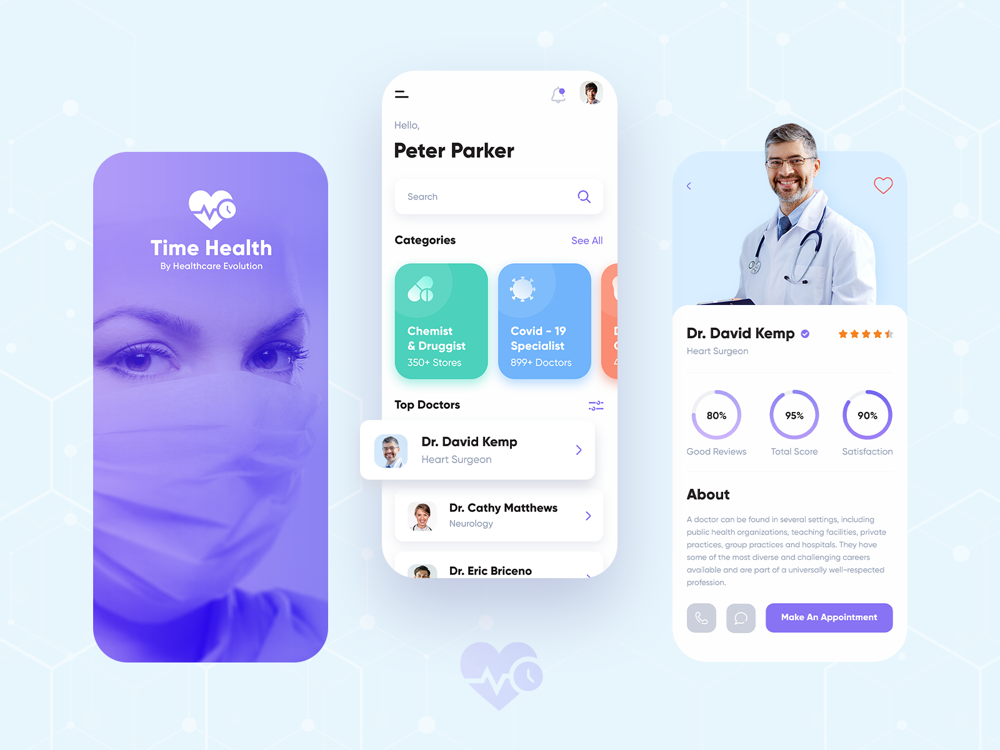
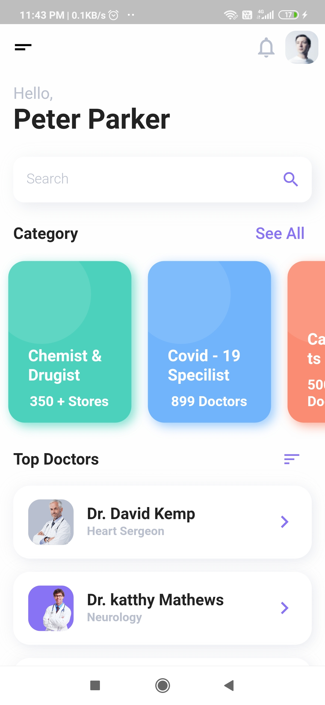
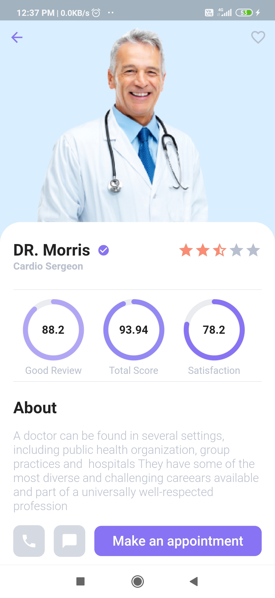
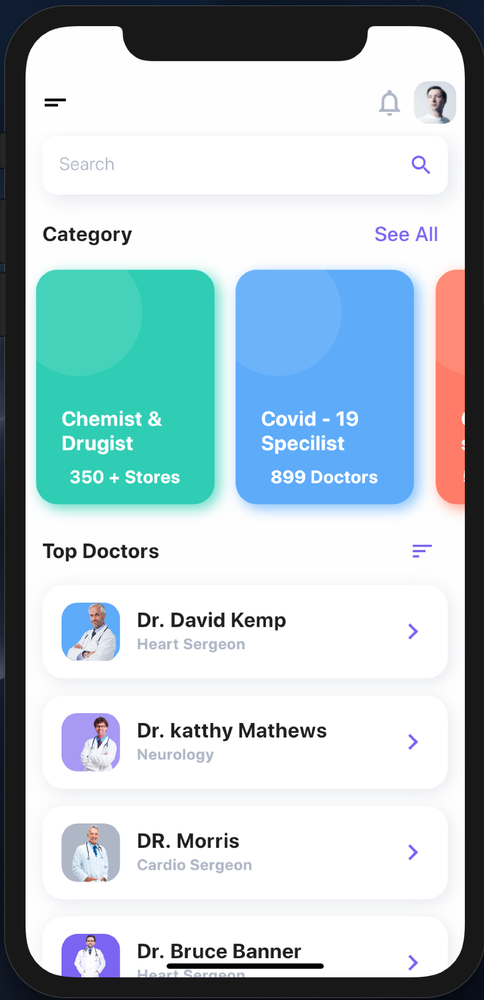
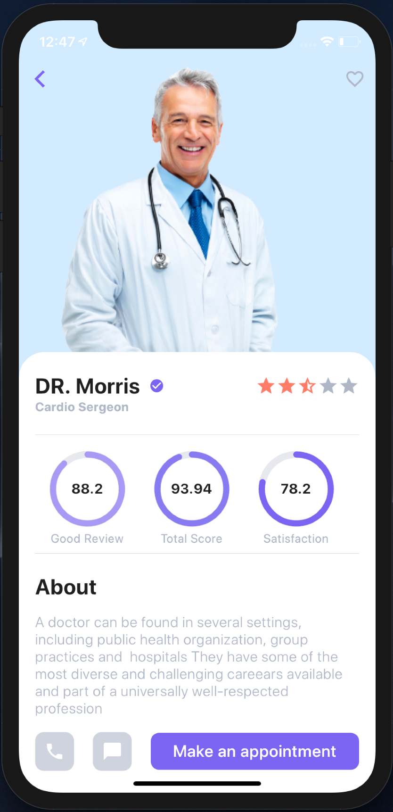

<div align="center">

# Healthcare Mobile App — Flutter

**Mo A** · Mobile App Developer (Flutter / Dart)


A cross-platform healthcare app for booking doctor appointments — browse doctors, view profiles and ratings, and book a visit, with a polished Material-based UI that runs natively on both Android and iOS from a single Flutter codebase.



</div>

---

## About

Built with **Flutter**, this app demonstrates a clean, production-style mobile architecture: a model/view-model separation, custom theming, and reusable widgets — the same patterns used for real client-facing mobile products.

## Screenshots

|  Android — Home  |  Android — Detail  |
|:---:|:---:|
|  |  |

|  iOS — Home  |  iOS — Detail  |
|:---:|:---:|
|  |  |

## Features

- 🩺 Doctor listing with search and category filters
- 📄 Doctor detail pages with ratings and profile info
- 📅 Appointment booking flow with date/time picker
- 🖼️ Custom splash screen and app-wide theming
- 📱 Fully responsive layouts, native on Android and iOS

## Tech Stack

| Layer | Technology |
|---|---|
| Framework | Flutter (Dart) |
| Architecture | Model / View-Model (`lib/src/viewModel`, `lib/src/model`) |
| Location | `geolocator`, `geocoder` |
| UI Components | Custom theming, `rating_bar`, `flutter_datetime_picker` |
| Testing | `flutter_test` (widget tests) |
| CI | GitHub Actions (`.github/workflows/dart.yml`) |

## Project Structure

```
lib
├── main.dart
└── src
    ├── config      # app routing
    ├── model       # data models
    ├── pages       # UI screens (home, detail, splash)
    ├── theme       # app theme, colors, text styles
    ├── viewModel   # view models per feature
    └── widgets     # reusable UI widgets
```

## Getting Started

```bash
git clone <this-repo-url>
cd healthcare-app-flutter
flutter pub get
flutter run
```

Requires the [Flutter SDK](https://docs.flutter.dev/get-started/install) (Dart >= 2.6.0).

## License

Licensed under the [MIT License](./LICENSE).
